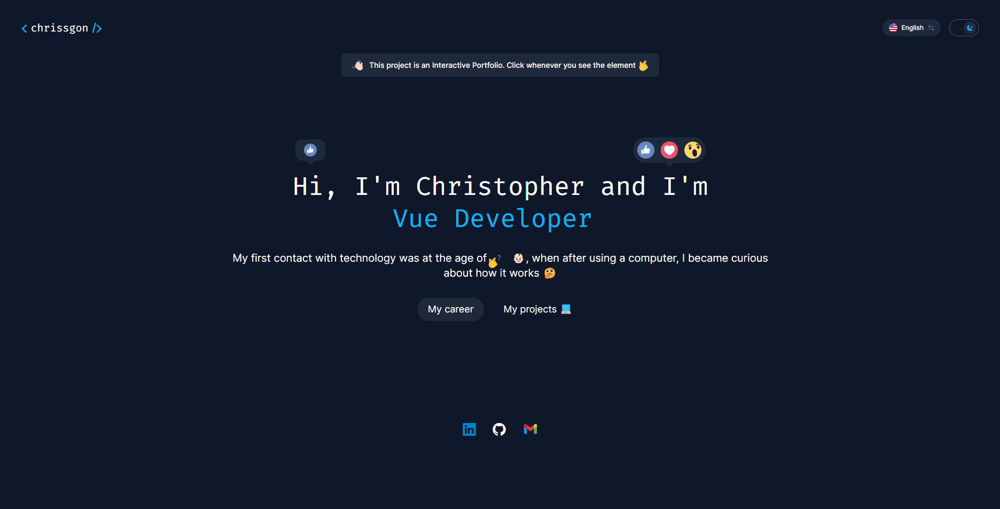

# Interactive Portfolio
###  Interactive Portfolio developed in Nuxt 3 + Typescript

## Comands
- Clone the repository.
``` bash
git clone git@github.com:chrissgon/portfolio.git
```
- Install dependencies.
``` bash
npm i
```
- Run application.
``` bash
npm run dev
```

## Anotations
Application hosted in <a href="http://localhost:3000/">http://localhost:3000/</a>.

## References
- [Figma Design](https://www.figma.com/file/YMuATy30gMHyjuzEah0UW7/Portfolio?t=UtfWb2l7p2VAcdgF-6)

---
Developed by [Christopher Gonçalves](https://github.com/chrissgon)