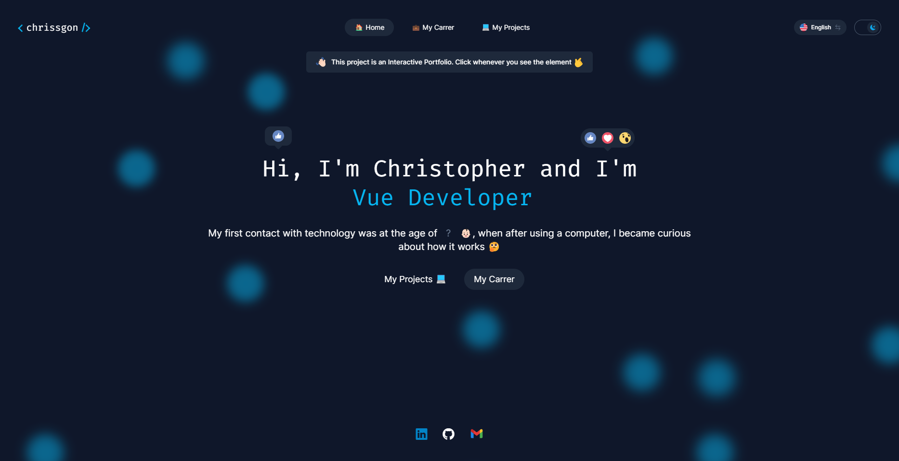

# Portfolio Interativo
### DESCRICAO

## Comandos
- Clona o repositório.
``` bash
git clone git@github.com:chrissgon/repo.git
```
- Instala dependências.
``` bash
npm i
```
- Executa aplicação.
``` bash
npm run dev
```

## Anotações
Aplicação hospedada em <a href="http://localhost:3000/">http://localhost:3000/</a>.

---
Desenvolvido por [Christopher Gonçalves](https://github.com/chrissgon)
